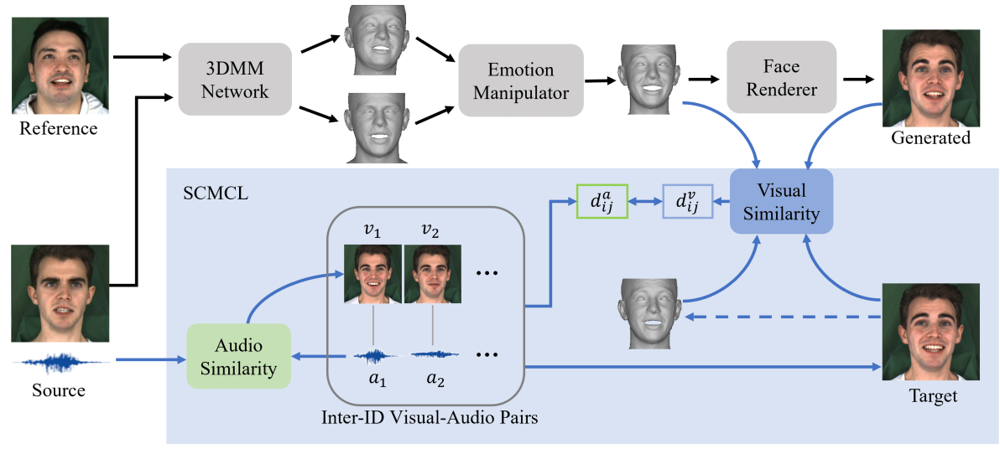
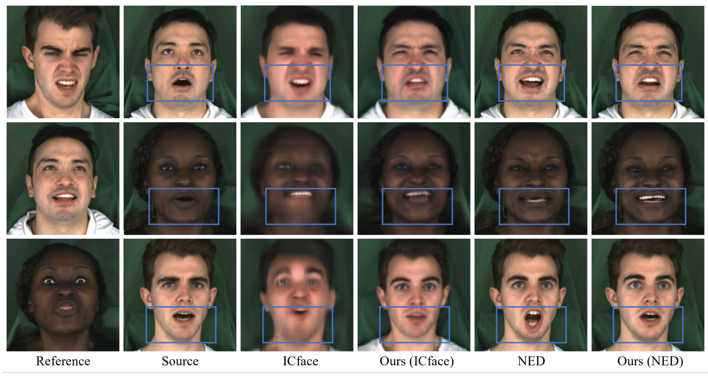
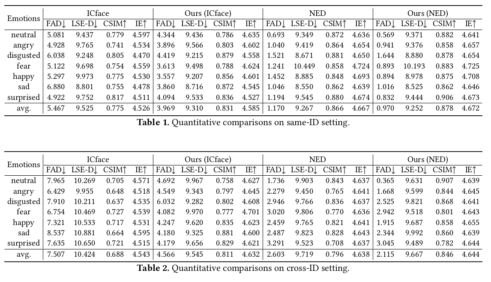

# Learning Symmetrical Cross-Modal Correlations for Speech-Preserving Facial Expression Manipulation

This repository contains the source code for our work:

> **Maintainer: Guohua Zhang**<br>

> **Abstract:** *Speech-preserving facial expression manipulation (SPFEM) aims to automatically modify facial emotions while maintaining speech content animations. However, it **lacks paired training examples** where two corresponding frames represent **identical speech content but with different emotions**. In this research, we **investigate the inherent characteristic of similar speeches having comparable facial expressions and mouth movements**. We introduce a novel symmetrical cross-modal correlation learning (SCMCL) framework that leverages this characteristic to establish paired supervision to improve facial expression manipulation. Specifically, the framework initially learns a symmetrical cross-modal met-
> ric, ensuring that **the similarity metric in one modality (e.g., audio) is strongly correlated with that in another modality (e.g., images)**. Given an input video clip, we can extract similar audio clips and their corresponding image frames in a specific emotion. We then ensure that the visual similarity between the generated image and the retrieved image correlates with the corresponding audio similarity. This approach can be effortlessly integrated with existing algorithms as an additional objective, providing detailed paired supervision for high-quality facial expression manipulation. Our extensive qualitative and quantitative evaluations across various settings demonstrate the effectiveness of the proposed algorithm.*


Framework of facial emotion manipulation while retaining the original mouth motion, i.e. speech. 



We show examples of 3 basic emotions. 



## Updates
**03/04/2023:** We have realeased some related works.

**07/02/2024:** We have added code and instructions for the training of our work.

## Getting Started
Clone the repo:
  ```bash
  git clone https://github.com/guohua-zhang/LSCMC.git
  cd LSCMC
  ```

### Requirements
Create a conda environment, using the provided ```environment.yml``` file.
```bash
conda env create -f environment.yml
```
Activate the environment.
```bash
conda activate NED
```

### Files
1. Follow the instructions in [DECA](https://github.com/YadiraF/DECA) (under the *Prepare data* section) to acquire the 3 files ('generic_model.pkl', 'deca_model.tar', 'FLAME_albedo_from_BFM.npz') and place them under "./DECA/data".
2. Fill out the [form](https://docs.google.com/forms/d/e/1FAIpQLScyyNWoFvyaxxfyaPLnCIAxXgdxLEMwR9Sayjh3JpWseuYlOA/viewform) to get access to the [FSGAN](https://github.com/YuvalNirkin/fsgan)'s pretrained models. Then download 'lfw_figaro_unet_256_2_0_segmentation_v1.pth' (from the "v1" folder) and place it under "./preprocessing/segmentation".

## Run

```
./scripts/preprocess.sh
./scripts/train.sh
./scipts/postprocess.sh
```


## Acknowledgements
We would like to thank the following great repositories that our code borrows from:
- [NED](https://github.com/foivospar/NED?tab=readme-ov-file)
- [Head2Head](https://github.com/michaildoukas/head2head)
- [StarGAN v2](https://github.com/clovaai/stargan-v2)
- [DECA](https://github.com/YadiraF/DECA)
- [FSGAN](https://github.com/YuvalNirkin/fsgan)
